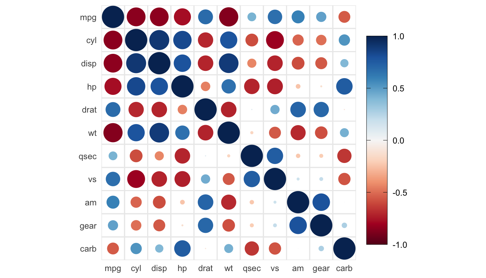
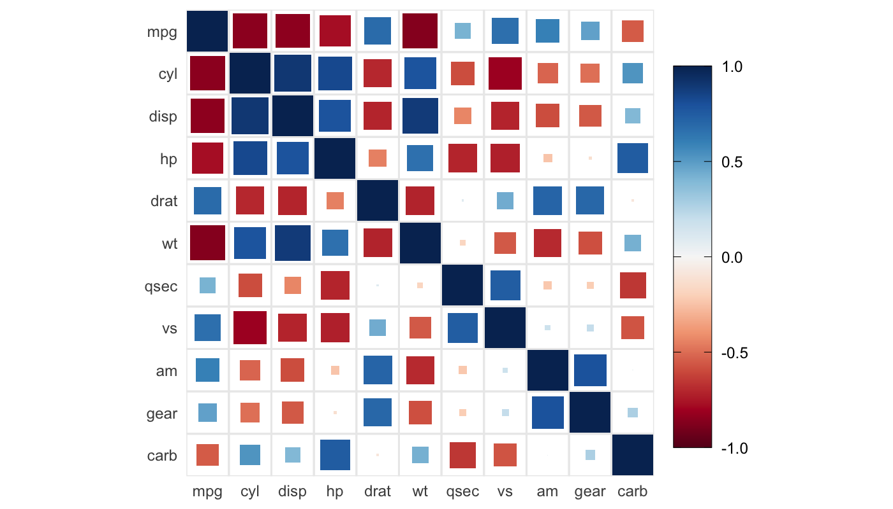
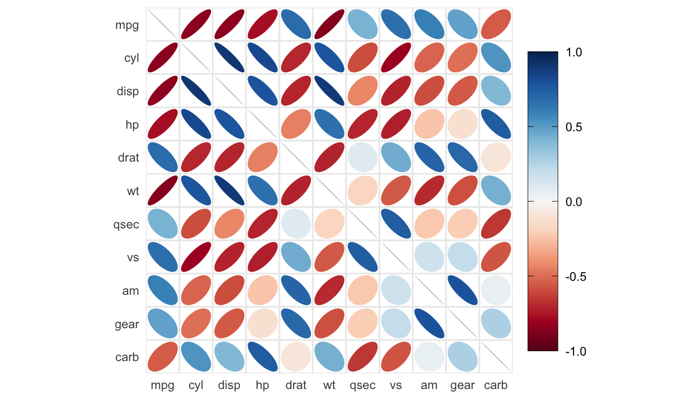
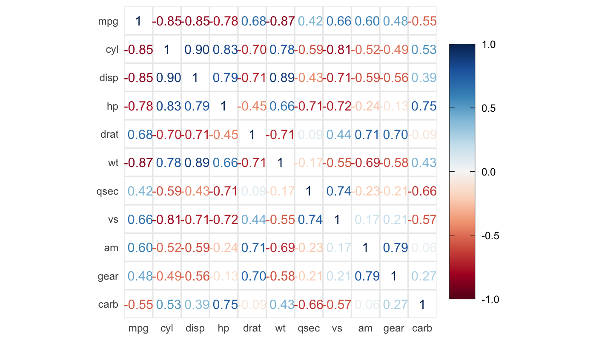
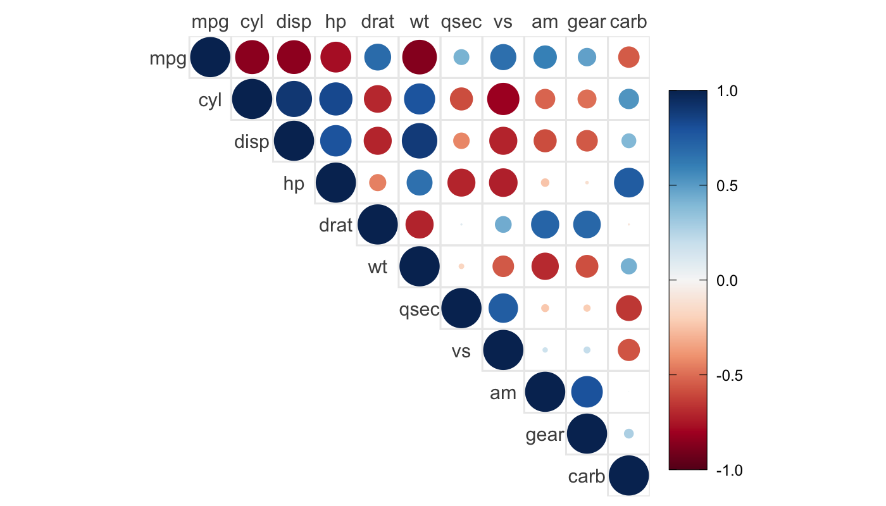
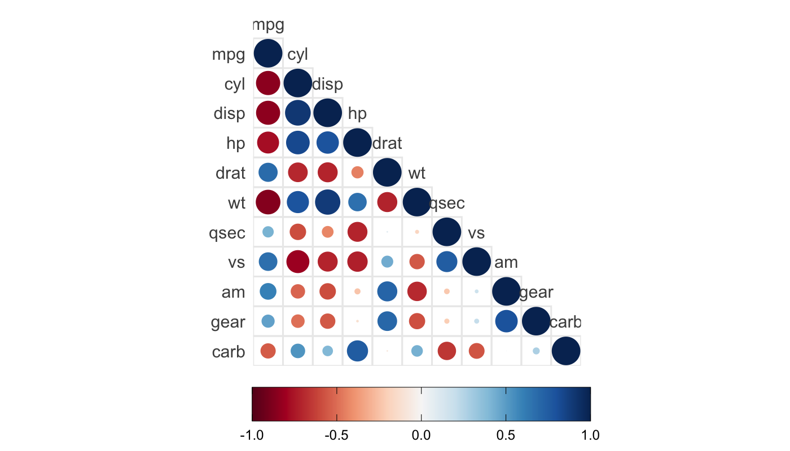
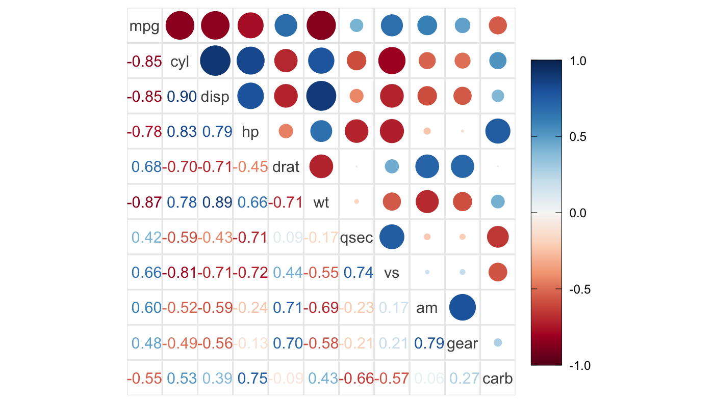
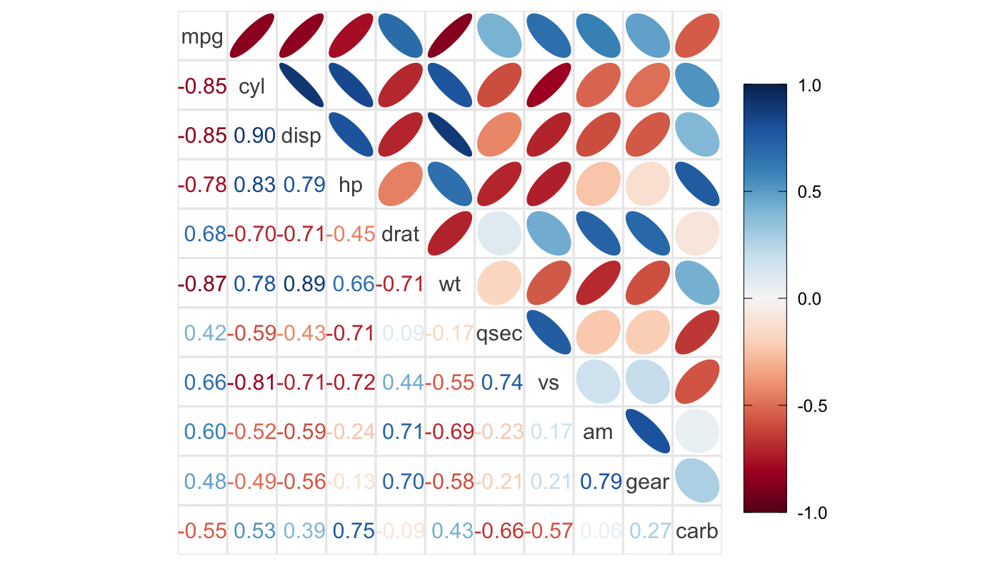
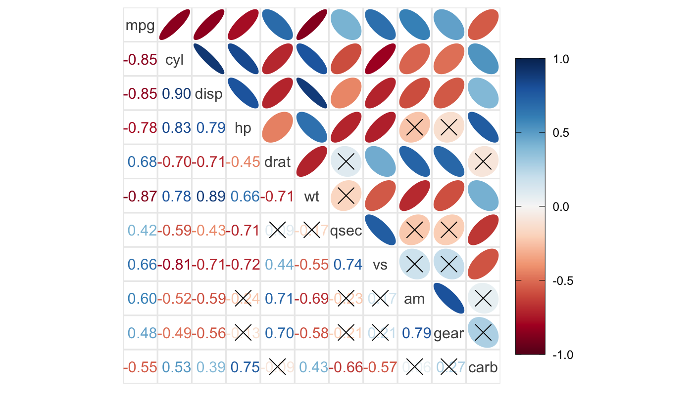
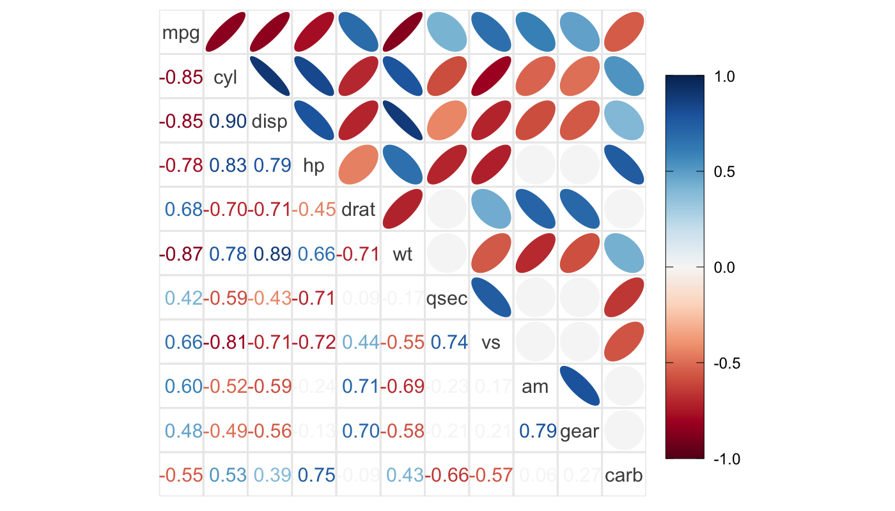

# ggcorrplot2

[](https://travis-ci.org/caijun/ggcorrplot2)

Implementation of corrplot using ggplot2

## Introduction

Reinventing wheels is not what I like doing.
[corrplot](https://CRAN.R-project.org/package=corrplot) is a great R
package, but I am really tired of customizing the appearance of
[corrgram](https://www.tandfonline.com/doi/abs/10.1198/000313002533),
e.g., the space between colorbar and its tick labels, space around the
plot that I don’t know how to control when writing it to PDF on my
macOS, etc. This is most likely because I am more familiar with the
Grammar of Graphics implemented in ggplot2 than the base plotting system
in R. There are several R packages (e.g.,
[ggcorrplot](https://github.com/kassambara/ggcorrplot) developed by
Alboukadel Kassambara, [ggcorr](https://github.com/briatte/ggcorr)
developed by François Briatte) that can visualize a correlation matrix
into a corrgram using ggplot2; however, they are unable to visualize a
correlation matrix using ellipse and mixed methods. **ggcorrplot2** has
implemented only a subset of features of **corrplot** to meet my urgent
needs. See examples in the **Getting started** section. More
functionality will be added in the future as needed.

## Installation

Get the development version from github:

``` r
if (!requireNamespace("devtools")) install.packages("devtools")
devtools::install_github("caijun/ggcorrplot2")
```

## Getting started

The `mtcars` dataset will be used to demonstrate the usages of
**ggcorrplot2**. Most parameters of **ggcorrplot2** functions are the
same as those of **corrplot**. Therefore, it’s easy for users to migrate
from **corrplot** to **ggcorrplot2**.

``` r
library(ggcorrplot2)

data(mtcars)
corr <- cor(mtcars)

# Visualize the correlation matrix
# --------------------------------
# method = "circle" (default)
ggcorrplot(corr)
```

<!-- -->

``` r
# method = "square"
ggcorrplot(corr, method = "square")
```

<!-- -->

``` r
# method = "ellipse"
ggcorrplot(corr, method = "ellipse")
```

<!-- -->

``` r
# method = "number", display the correlation coefficients
ggcorrplot(corr, method = "number")
```

<!-- -->

``` r
# Visualize the upper or lower triangle of correlation matrix
# -----------------------------------------------------------
# the upper triangle
ggcorrplot(corr, type = "upper")
```

<!-- -->

``` r
# the lower triangle
ggcorrplot(corr, type = "lower")
```

<!-- -->

``` r
# Visualize the correlation matrix using mixed methods
# ----------------------------------------------------
# default: upper = "circle", lower = "number"
ggcorrplot.mixed(corr)
```

<!-- -->

``` r
# upper = "ellipse", lower = "number"
ggcorrplot.mixed(corr, upper = "ellipse", lower = "number")
```

<!-- -->

``` r
# Combine correlogram with the significance test
# ----------------------------------------------
p.mat <- cor.mtest(mtcars, conf.level = 0.95)
# Insignificant coefficients according to the default significant level 
# (sig.lvl = 0.05) are indicated by X by default.
ggcorrplot.mixed(corr, upper = "ellipse", lower = "number", p.mat = p.mat)
```

<!-- -->

``` r
# Leave blank on insignificant coefficients
ggcorrplot.mixed(corr, upper = "ellipse", lower = "number", p.mat = p.mat, 
                 insig = "blank")
```

<!-- -->

The above examples reproduce some features of **corrplot**. In the
following example, the added advantages of implementing **corrplot**
using ggplot2, such as customizing the appearance of corrgram, combining
a corrgram with other plots (including non-corrgrams) into one plot
using [cowplot](https://github.com/wilkelab/cowplot), are demonstrated.

``` r
# Combine a lower corrgram and a mixed corrgram side by side with a shared colorbar on the bottom
# a lower corrgram
p1 <- ggcorrplot(corr, type = "lower", method = "square")
# a mixed corrgram
p2 <- ggcorrplot.mixed(corr, upper = "ellipse", lower = "number", p.mat = p.mat)

library(cowplot)
prow <- plot_grid(p1 + ggplot2::theme(legend.position = "none"),
                  p2 + ggplot2::theme(legend.position = "none"),
                  rel_widths = c(1, 1), nrow = 1, align = 'hv',
                  labels = c("(a)", "(b)"), label_x = 0, label_y = 1)

# Extract the legend from the first corrgram
legend <- get_legend(p1)
# Add the legend to the bottom of the plot row we made earlier.
p <- cowplot::plot_grid(prow, legend, ncol = 1, rel_heights  = c(1, 0.15))
p
```


## Contact

Bugs and feature requests can be filed to
<https://github.com/caijun/ggcorrplot2/issues>. Pull requests are also
welcome.
